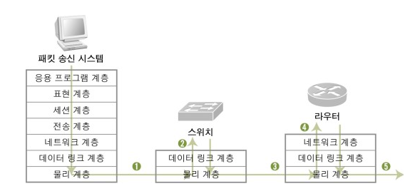

# CH.03 트랜스포트 계층

## 3.1 트랜스포트 계층 서비스 및 개요

- 트랜스포트 계층 프로토콜은 서로 다른 호스트에서 동작하는 애플리케이션 **프로세스들 간의** 논리적 통신을 제공
- ✏️ `논리적통신`(Logical communication)?
  - 애플리케이션의 관점에서 보면, (프로세스들이 동작하는) 호스트들이 직접 연결된 것처럼 보인다는 것을 의미
  - 역할: 호스트가, 하위 물리적 계층를 신경쓰지 않고 메시지를 송신하기 위해서
    > 실제로 호스트는 *수많은 라우터와 다양한 형태의 링크*를 통해 연결되어 지구상의 서로 다른 지역에 있을 수 있음
    애플리케이션 프로세스는 *메시지 운반에 사용되는 물리적인 하위 구조*의 세부사항에 상관없이 서로 메시지를 송신하기 위해서 트랜스포트 계층에서 제공하는 논리적 통신을 사용

    > 🔍 하위 계층은 트랜스포트 계층의 관심 범위가 아니다. 자세한 설명은 3.1.1에서 예시를 통해 확인!

- 송신하는 경우
  - `메시지`(애플리케이션 계층) → `세그먼트`(트랜스포트 계층, L4) → **변환과정** → `데이터그램`(네트워크 계층, L3)
  - 변환과정
    1. 메세지를 작은 여러개의 조각으로 분할
    2. 각각의 조각에 트랜포트 계층 헤더를 추가

  > - 송신 측의 트랜스포트 계층은 송신 애플리케이션 프로세스로부터 수신한 메시지를, 트랜스포트 계층 세그먼트(segment)인 트랜스포트 계층 패킷으로 변환  
  > - 변환은, 애플리케이션 메시지를 트랜스포트 계층 세그먼트로 만들기 위해 작은 조각으로 분할하고, 각각의 조각에 트랜스포트 계층 헤더를 추가함으로써 수행됨  
  > - 이후, 트랜스포트 계층은 송신 종단시스템에 있는 네트워크 계층으로 세그먼트를 전달하고, 여기서 세그먼트가 네트워크계층 패킷(데이터그램) 안에 **캡슐화되어 목적지로 전달**됨  

- 수신하는 경우
  - 송신 과정의 반대 순서로 처리
  - 수신측에서 네트워크 계층은 데이터그램으로부터 트랜스포트 계층 세그먼트를 추출하고 트랜스포트 계층으로 세그먼트를 보냄
  - 이후에 트랜스포트 계층은 수신 애플리케이션에서 세그먼트 내부의 데이터를 이용할 수 있도록 수신된 세그먼트를 처리

- 트랜스포트 계층 프로토콜은 네트워크 라우터가 아닌 종단시스템(=호스트)에서 구현됨
- 네트워크 라우터는 오로지 데이터그램의 네트워크 계층 필드에 대해 동작
  - = 라우터는 (데이터그램과 함께 캡슐화 된) 트랜스포트 계층 세그먼트의 필드를 검사하지 않음
  - 중간 라우터는 트랜스포트 계층이 애플리케이션 메시지에 추가한 어떤 정보도 인식하지 못하며, 그 정보에 영향을 주지도 않음
- 네트워크 애플리케이션에는 하나 이상의 트랜스포트 계층 프로토콜이 사용 가능 ❓
  - 네트워크 애플리케이션: 각자 다른 end system에서 동작하고 네트워크를 통해 서로 통신하는 프로그램
  - 예를들어 인터넷은 TCP와 UDP라는 두 가지 프로토콜을 가지고 있음
  - 이러한 프로토콜 서비스를 요청하는 애플리케이션에게 트랜스포트 계층에서 서로 다른 서비스 집합을 제공

---

### 3.1.1 트랜스포트 계층과 네트워크 계층 사이의 관계

- 트랜스포트 계층은 네트워크 계층 바로 상위에 존재
- `트랜스포트 계층 프로토콜`: 서로 다른 호스트에서 동작하는 **프로세스들 사이**의 논리적 통신을 제공
- `네트워크 계층 프로토콜`: **호스트들 사이**의 논리적 통신을 제공
- 예시: 우편배달
  - 동부, 서부에 각각 집이 있음
  - 두 집안에는 아이들이 사는데, 이 아이들끼리 서로 편지쓰기를 좋아함
  - 서부에는 앤, 동부에는 빌 이라는 집사가 있음
  - 앤과 빌의 역할: 아이들의 편지를 모아서 집배원에게 전달하는 역할과 집배원이 가져다 준 편지를 아이들에게 나눠주는 것
  - 동부와 서부 사이에 편지를 전달하는 일은 집배원이 담당
  - 다음과 같이 매칭될 수 있음
    - 애플리케이션 메시지 = 봉투 안의 편지
    - 프로세스 = 아이들
    - 호스트(종단 시스템) = 집
    - 트랜스포트 계층 프로토콜 = 앤, 빌
    - 네트워크 계층 프로토콜 = 집배원(우편서비스)
    - 
  - 트랜스포트 프로토콜(앤, 빌)은 `애플리케이션 프로세스 ~ 네트워크 경계` 간 메시지를 운반
  - 서부와 동부에 각각 수잔과 하비라는 집사가 추가로 고용되었다고 해보자,
    - 앤과 빌은 편지를 우편물을 정확히 전달할 수 있으나, 수잔과 하비는 우편물을 제대로 전달하지 못할 수 있음 (최선을 다하지만 우편물을 종종 잃어버리기도 함)
    - 앤과 빌은 TCP, 수잔과 하비는 UDP
    - 컴퓨터 네트워크는 (애플리케이션에게 서로 다른 서비스를 제공하도록 하는 개별 프로토콜을 갖는) 다양한 트랜스포트 프로토콜을 만들 수 있게 함
  - 우편 서비스가, 두 집 사이에서 우편물이 배달되는 데 소요되는 최대기간을 보장하지 않는다면?
    - 트랜스포트 계층이 제공할 수 있는 서비스는 하위 네트워크 계층 프로토콜의 서비스 모델에 의해서 제약받음
      - 하위 계층이 지연보장, 대역폭 보장이 불가능하다면, 트랜스포트 계층 프로토콜은, 프로세스끼리 전송하는 메시지에 대한 지연보장, 대역폭 보장 등을 제공 불가
      - 하위 네트워크 프로토콜이 상응하는 서비스를 제공하지 못할 때에도(하위 네트워크 프로토콜이 비신뢰적일 때), 특정 서비스는 트랜스포트 프로토콜에 의해서 제공될 수 있음

---

### 3.1.2 인터넷 트랜스포트 계층의 개요

TCP/IP 네트워크는 애플리케이션 계층에게 두 가지 구별되는 트랜스포트 계층 프로토콜들을 제공

- UDP(User Datagram Protocal): (애플리케이션에게) 비신뢰적이고 비연결형인 서비스를 제공
- TCP(Transmission Control Protocol): (애플리케이션에게) 신뢰적이고 연결지향형 서비스를 제공

> - 애플리케이션 개발자는 이 두가지 트랜스포트 프로토콜 중의 하나를 명시해야함  
> - 소켓을 생성할 때, TCP와 UDP 중 하나를 선택해야 함

> TCP 패킷 → 세그먼트  
> UDP 패킷 → 데이터그램  
> 위처럼 표현하기도 하지만 네트워크 계층의 데이터그램과 혼동될 수 있으므로, 여기서는 세그먼트라는 용어로 통일하여 사용

#### IP 서비스 모델 → 네트워크 계층에 대한 간략한 설명

- 트랜스포트 계층의 바로 아래 하위 계층
- 네트워크 계층 프로토콜: 인터넷 프로토콜(IP)
- IP 서비스 모델은 호스트 들 간에 논리적 통신을 제공하는 최선형 전달 서비스
- **최선형 전달 서비스** (best-effort delivery service)
  - 통신하는 호스트들 간에 세그먼트를 전달하기 위해서 최대한 노력하지만, 어떤 보장도 하지 않음
  - 세그먼트의 전송, 순서, 내부 데이터의 데이터 무결성(integrity, 오류검출) 등을 보장하지 않음
  - 따라서 **IP는 비신뢰적 서비스**(unreliable service)
- 각 호스트가 적어도 하나의 IP 주소를 가지고 있음

#### TCP, UDP의 서비스 모델 → 트랜스포트 계층에 대한 간략한 설명

- UDP, TCP의 가장 기본적인 기능
  1. 트랜스포트 다중화(transport multiplexing), 역다중화(demultiplexing)
     - 종단 시스템 사이의 IP 전달 서비스를 종단 시스템에서 동작하는 두 프로세스 간의 전달 서비스로 확장
     - "호스트 대 호스트 전달"을 "프로세스 대 프로세스 전달"로 확장
  2. 무결성 검사(오류검출)
     - 헤더에 오류 검출 필드를 포함
- UDP
  - 가장 기본적인 기능 두 가지 서비스만 제공
    1. 프로세스 대 프로세스 데이터 전달
    2. 오류 검출
  - 비신뢰적인 서비스
    - 프로세스에 의해서 전송된 데이터가 손상되지 않고, 목적지에 도착한다는 것을 보장하지 않음
- TCP
  - 신뢰적인 데이터 전달(reliable data transfer)
    - 흐름제어, 순서번호, 확인응답, 타이머등의 기술을 사용
    - 위의 기술을 사용함으로써, 프로세스에게 데이터가 순서대로 정확하게 전달되도록 확실히 함
  - 종단 시스템 간에 IP의 비신뢰적 서비스를 프로세스 사이의 신뢰적인 데이터 전송 서비스로 만듦
  - 혼잡제어(congestion control) 사용
    - → 보내는 쪽의 트래픽을 조절하여, 스위치/링크의 혼잡을 방지
    - TCP 연결이 과도한 양의 트래픽으로 모든 통신하는 호스트들 사이의 스위치와 링크를 폭주되게 하는 것을 방지
    - 특정 애플리케이션이 제공하는 특정 서비스가 아니라, 전체를 위한 서비스

    > - 혼잡한 네트워크 링크에서 각 TCP 연결이 링크의 대역폭을 공평하게 공유하여 통과하도록 해줌  
    > - 송신(보내는 쪽) 측의 TCP가 네트워크에 보낼 수 있는 트래픽을 조절함으로써 수행됨  
